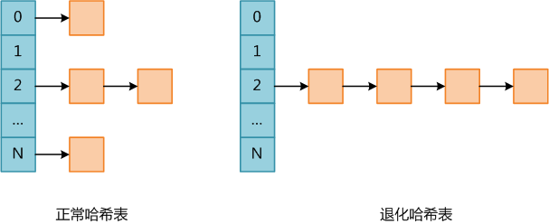

# 哈希表碰撞攻击的基本原理

哈希表是一种查找效率极高的数据结构，很多语言都在内部实现了哈希表。Solidity中的Mapping可以看作是哈希表，它是一种极为重要的数据结构，同时是一种高效且经济的存储类型为众多开发人员所推崇。

理想情况下哈希表插入和查找操作的时间复杂度均为O(1)，任何一个数据项可以在一个与哈希表长度无关的时间内计算出一个哈希值（key），然后在常量时间内定位到一个桶（术语bucket，表示哈希表中的一个位置）。当然这是理想情况下，因为任何哈希表的长度都是有限的，所以一定存在不同的数据项具有相同哈希值的情况，此时不同数据项被定为到同一个桶，称为碰撞（collision）。哈希表的实现需要解决碰撞问题，碰撞解决大体有两种思路，第一种是根据某种原则将被碰撞数据定位到其它桶，例如线性探测——如果数据在插入时发生了碰撞，则顺序查找这个桶后面的桶，将其放入第一个没有被使用的桶；第二种策略是每个桶不是一个只能容纳单个数据项的位置，而是一个可容纳多个数据的数据结构（例如链表或红黑树），将所有碰撞的数据以某种数据结构的形式组织起来。
不论使用了哪种碰撞解决策略，都导致插入和查找操作的时间复杂度不再是O(1)。以查找为例，不能通过key定位到桶就结束，必须还要比较原始key（即未做哈希之前的key）是否相等，如果不相等，则要使用与插入相同的算法继续查找，直到找到匹配的值或确认数据不在哈希表中。

由于solidity mapping是存储在storage，理论上是一个超大的空间，相对来讲，发生碰撞的概率更低。但对于攻击方来讲，一旦找到Hash函数的漏洞，通过程序来制造碰撞并不困难。对于solidity合约来讲，应对不合理，也是会招致DoS潜在风险。

假设Solidity使用单链表存储碰撞的数据，因此实际上此类哈希表的平均查找复杂度为O(L)，其中L为桶链表的平均长度；而最坏复杂度为O(N)，此时所有数据全部碰撞，哈希表退化成单链表。下图是正常哈希表和退化哈希表的示意图。

哈希表碰撞攻击就是通过精心构造数据，使得所有数据全部碰撞，人为将哈希表变成一个退化的单链表，此时哈希表各种操作的时间均提升了一个数量级，因此会消耗大量CPU资源，导致系统无法快速响应请求，从而达到拒绝服务攻击（DoS）的目的。

进行哈希碰撞攻击的前提是哈希算法特别容易找出碰撞。幸运的是目前Solidity的Hash算法还没有听说被此类攻击所攻破。

# 如何防御

尽管当下Solidity所用的Hash算法比较强，但作为开发者我们心里应该知道，没有攻不破的城墙，所以针对这个潜在风险不多些警惕与防范。具体步骤可以有：

1. 及时关注solidity的补丁信息，有关Hash的升级请及时更新到最新。
2. 有关mapping的访问上，可以的话，不妨限制每次交易所能进行更新操作的次数。
3. 可以话，在mapping的访问上，增加相应的访问控制，以杜绝不良账户的访问。
4. 另外，还可以请求Dapp的帮助，请求它们直接拦截异常请求。