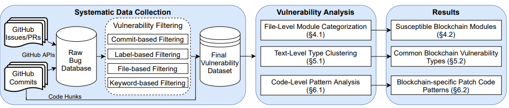

在这个系列里，我们将一起学习一篇论文：https://arxiv.org/pdf/2110.12162.pdf

这篇文章作者对区块链的脆弱性，采用独特地方法论，进行深入的探讨。为我们理解或梳理区块链的漏洞，提供了非常有意义的探索。下面是这篇论文的摘要和介绍。

# 摘要

大家都知道，区块链作为最近涌现出来的技术，其具有去中心化的特质，以及拥有加密货币属性和智能合约功能，让许多人都看好它，把它当作人类下一代IT革命的引擎技术。但是，区块链本质上是一款去中心化的超级账本软件，因此它不可避免地会存在软件上的漏洞。目前关于区块链的研究，大都聚焦在基于该技术智能合约和具体的应用上面，包括关于区块链安全方面也主要在合约和应用，而关于其底层系统级的安全漏洞则少有涉猎。这里，我们将针对具有代表性的区块链（比特币、以太坊等），探究区块链可能存在的系统漏洞。

目前关于区块链没有CVE信息发布系统，好在区块链都是开源的软件，因此我们收集它们Github上的Issues，以及PRs(pull requests)，并从中抽取了上千个区块链漏洞，以及超过2000多个的补丁，来让大家看到这个技术存在的系统漏洞，以及可以补救办法。我们把收集到的脆弱点构建了一个数据集，并在该数据集上，我们将开展三种层级的分析：、

1. 文件级，旨在找到易受攻击的模块，这个是通过不同区块链工程项目的模块路径来达到目标；
2. 文本级，旨在发现易受攻击的类型，这个是通过自然语法和NLP来达到目标；
3. 代码级，旨在寻找易受攻击的模式，这个则是通过分析处理补丁的代码片段来达到目标的。

经过仔细的分析，大家将会得到3个主要的发现：

1. 有此区块链的模块相比其它模块更值怀疑，特别是那些关于共识、钱包和网络的模块应当重点关注，因为它个每个都有超过200个的issues。
2. 区块链的漏洞类型70%以上是与传统软件上已有的，但在这里，将提出4种全新的类型。
3. 多达21种的专属于区块链的攻击模式，包括检查区块链的唯一属性，验证各种区块链状态；并在这里，我们将演示通过这些模式，怎样来找到这些区块链中的被攻击点。

# 介绍

自从区块链首次被Bitcoin作为其加密货币交易账本以来，它就成为许多加密货币的底层设施了。并且它促使加密货币市场指数级增长，截止2021年4月初，它的市值总额已超过了2万亿USD[32]。而且基于这些区块链技术演进、智能合约，以及各类DApp也是如雨后春笋般涌现：像智能合约平台以太坊[14]和超级账本Fabric[9]，去中心化的计算平台星际文件系统IPFS[13]和Blockstack[8]，像去中心化金融（DeFi）[55]，智能合约预言机[61,62]，去中心化身份识别[43]，去中心化IoT管理[49]，基于去中心化应用市场[17]等等。为了保护这些系统的去中心化，保护它们的紧密相关加密货币的安全性，这些区块链的安全就特别值得我们关注了。

目前关于区块链安全的研究，主要聚焦在智能合约漏洞检查和网络安全分析上。特别是许多程序静态分析工具，例如Oyente[42], Zeus[29],Securify[52],Gigahorse[25], 以及ETHBMC[21], 它们都是基于语法的执行和模型检查，来探测智能合约可能存在的漏洞。而动态工具[19,27,47,51]和基于学习的工具[24,38,41]也被发明出来了。它们除了会进行应用程序级合约的分析，有此还会分析网络级的黑客攻击，挖矿攻击，以及交易执行级别攻击[20,31,63,66]。然而，关于区块链本身自己系统的安全问题，则很少有人探究。据我们所知，目前只有一篇这样的研究[53]（来自软件工程社区）是这个方向。在这篇研究中，它具体分析了946种区块链的bugs，其中涵盖了18个安全相关的bugs，并对其中4个进行了剖析。

在这篇文章中，我们从理解区块链的脆弱性目标出发，从4个有代表性的区块链（包括经典Bitcoin[45], 智能合约平台以太坊[14], 匿名coin Monero[46], 以及支付网络Stellar[39]）入手，来导出区块链实证存在的漏洞。这4种区块链不仅在加密货币市场广泛流行，而且也有扎实的技术文章支持。

本文的区块链漏洞探索的整体工作流程如下图所示：

正如上图所示，我们研究的第一步挑战就是要有效地收集这4个区块链中，易受攻击的issues，以及它们应对的补丁。这步的困难主要是针对这些区块链工程，基本没有可用的CVE（Common Vulnerabilities & Exposures）信息，以及大量原始的区块链bugs（超过34K）；我们只能从这此庞大的bugs数据源中去出与安全漏洞相关的bugs，如果完全通过手工的方式去提取，简直就是不可完成的任务。为此，我们基于这些漏洞会有不同的特征和不同级别的直觉，提出了个过滤框架，让我们可以通过分析bug的属性，由粗到精地逐步识别出侯选的漏洞。具体的，我们将针对提交、文件、标签和关键词4种级别，来执行过滤。最后，我们获得了1037个漏洞，以及针对它们的2317个补丁，并把它们当作我们区块链脆弱性研究的数据集。

基于为个数据集，我们将拓展3个主要方面的，尚未发现的区块链脆弱性，包括：可疑的区块链模块，通用区块链脆弱性类型，以及区块链专有的补丁代码模式。最后，我们将在下面完成区块链“文件级”、“文本级”和“代码级”脆弱性的分析。

首先，我们通过审查打过补丁的文件，来进行模块的分析。但是，对每个文件进行逐个审查，是特别费时间的事情，因为光路径就有2362个。我们建议通过识别模块路径的来先找到需要分析的模块。因为文件夹的名字往往会概括出该模块所包含的文件 （例如"rpc/"文件夹，往往就表示其下的文件是属于RPC模块）。然后，我们再进一步把这些模块路径根据不同的区块链，根据它们的架构关联起来，让为些不同的模块与它们的架构对应起来。这种文件级模块分类方法，让我们可以区块链的脆弱性，拥有一个分层的视角，进而准确地指出它们可疑的区块链模块。通过这个审查，我们发现有的模块，相对其它模块，更值得我们怀疑，像共识模块，钱包模块和网络模块，因为它们每个都超过200个Issues了。除了这些模块在区块链系统中被广泛使用之外，我们还看到它们代码的复杂度也远高于其它模块。

接着，我们对脆弱性的文本进行了类型分析。更具体点，是对数据集中issues的titles进行了分析。因为脆弱性类型往往由issue/PR（pull request）的title概括了，例如，Bitcoin PR #17460 "wallet: Fix uninitialized read in bumpfee(...),"，这里“uninitialized read”就是类型。为了消灭噪声词，进而获得高质量的类型集合，我们在首次抽取“类型”时，也就是在导出类型集合前，引入了NLP（natural language processing）进行了分词分析处理；基于行文语法模式，这些类型词往往会在一个动词后面(如“fix”)，或介词的前头（例如“in”）。通过抽取各种情形下的类型关键词，以及合适的聚合算法，我们成功地将75.8%的脆弱性映射了不同的类型中。我们并将分析最典型的20种，这20种类型每个至少都发现了不少于10个的漏洞。其中有4种新的脆弱性类型，它们专属于区块链；另外也看到，传统的脆弱性类型在区块链中仍然占有62%~78%的比重。

最后，我们引入了模式分析来分析针对这些脆弱性的补丁代码。分析这些补丁代码时，我们主要聚焦在专属于区块链的脆弱性类型，因为传统的脆弱性类型更加广为人知，或有更多文章描述（有兴趣的同学，可以自行找寻资料）。为了让相似的补丁代码归入同样的类型集合，我们设计并生成了一个“代码修改签名”，它将获取语义和语法上一致的代码片段。通过把3251个代码片段，聚合成174个代码修改签名，我们识别出21个区块链专用有的脆弱性模式。基于这些模式，区块链会去检查它的属性（例如发送者的地址，交易顺序，区块头，以gas限制），并确保节点同步期间各种区块链状态、对等节点验证、钱包和数据库操作的有效性。我们进一步利用这些模式，在其它排名靠前的区块链中，发现了23个同样的漏洞。其中受影响的就有6个区块链，包括了以下著名的项目：Dogecoin, Bitcoin SV和Zcash；截止2021年10月，这些区块链所占的市场资本超过了400亿USD。大多数我们的漏洞报告，已经被这些区块链的开发者确认了，并正在为这些漏洞打着补丁。这也表明我们的脆弱性模式，正在给现实世界带来影响。

总这，在这篇论文里提供了一组方法学，来分析区块链的漏洞，来构建相关的知识基础，并挖掘出这些漏洞内在的东西。为了方便以后研究，我们也将在社区里，公开我们收集好的数据集。

*未完，待续...*

# 参考

[1] 2019. Bitcoin Core 0.11 (ch 1): Overview. https://en.bitcoin.it/wiki/Bitcoin_Core_0.11_(ch_1):_Overview.

[2] 2020. Bitcoin Core: The Reference Implementation. https://cypherpunks-core.github.io/bitcoinbook/ch03.html.

[3] 2020. NLTK: Natural Language Toolkit. https://www.nltk.org/.

[4] 2020. spaCy: Industrial-Strength Natural Language Processing. https://spacy.io/.

[5] 2021. Agglomerative Clustering. https://scikit-learn.org/stable/modules/generated/sklearn.cluster.AgglomerativeClustering.html.

[6] 2021. Gaussian Mixture Models. https://scikit-learn.org/stable/modules/generated/sklearn.mixture.GaussianMixture.html.

[7] 2021. Swarm. https://github.com/ethersphere/swarm.

[8] Muneeb Ali, Jude Nelson, Ryan Shea, and Michael J Freedman. 2016. Blockstack: A global naming and storage system secured by blockchains. In USENIX ATC.

[9] Elli Androulaki, Artem Barger, Vita Bortnikov, Christian Cachin, Konstantinos Christidis, Angelo De Caro, David Enyeart, Christopher Ferris, Gennady Laventman, and Yacov Manevich. 2018. Hyperledger Fabric: A distributed operating system for permissioned blockchains. In Proc. ACM EuroSys.

[10] Maria Apostolaki, Aviv Zohar, and Laurent Vanbever. 2017. Hijacking Bitcoin: Routing Attacks on Cryptocurrencies. In Proc. IEEE Symposium on Security and Privacy.

[11] David Arthur and Sergei Vassilvitskii. 2007. K-Means++: The Advantages of Careful Seeding. In Proc. ACM SODA.

[12] Ira D. Baxter, Andrew Yahin, Leonardo Moura, Marcelo Sant’Anna, and Lorraine Bier. 1998. Clone Detection Using Abstract Syntax Trees. In Proc. ACM ICSE.

[13] Juan Benet. 2014. IPFS-content addressed, versioned, p2p file system. CoRR arXiv abs/1407.3561 (2014).

[14] Vitalik Buterin. 2014. A next-generation smart contract and decentralized application platform. white paper (2014).

[15] Yan Cai and Wing-Kwong Chan. 2014. Magiclock: Scalable detection of potential deadlocks in large-scale multithreaded programs. IEEE Transactions on Software Engineering (2014).

[16] Haogang Chen, Yandong Mao, Xi Wang, Dong Zhou, Nickolai Zeldovich, and M. Frans Kaashoek. 2011. Linux Kernel Vulnerabilities: State-of-the-Art Defenses and Open Problems. In Proc. ACM APSys.

[17] Mengjie Chen, Daoyuan Wu, Xiao Yi, and Jianliang Xu. 2021. AGChain: A Blockchain-based Gateway for Permanent, Distributed, and Secure App Delegation from Existing Mobile App Markets. CoRR arXiv abs/2101.06454 (2021).

[18] Shuo Chen, Zbigniew Kalbarczyk, Jun Xu, and Ravishankar K Iyer. 2003. A data-driven finite state machine model for analyzing security vulnerabilities. In Proc. IEEE DSN.

[19] Ting Chen, Rong Cao, Ting Li, Xiapu Luo, Guofei Gu, Yufei Zhang, Zhou Liao, Hang Zhu, Gang Chen, Zheyuan He, Yuxing Tang, Xiaodong Lin, and Xiaosong Zhang. 2017. SODA: A Generic Online Detection Framework for Smart Contracts. In Proc. ISOC NDSS.

[20] Ting Chen, Yuxiao Zhu, Zihao Li, Jiachi Chen, Xiaoqi Li, Xiapu Luo, Xiaodong Lin, and Xiaosong Zhang. 2018. Understanding Ethereum via Graph Analysis. In Proc. IEEE INFOCOM.

[21] Joel Frank, Cornelius Aschermann, and Thorsten Holz. 2020. ETHBMC: A Bounded Model Checker for Smart Contracts. In Proc. USENIX Security.

[22] Brendan J. Frey and Delbert Dueck. 2007. Clustering by Passing Messages Between Data Points. Science (2007).

[23] Shang Gao, Zecheng Li, Zhe Peng, and Bin Xiao. 2019. Power Adjusting and Bribery Racing: Novel Mining Attacks in the Bitcoin System. In Proc. ACM CCS.

[24] Zhipeng Gao, Lingxiao Jiang, Xin Xia, David Lo, and John Grundy. 2020. Checking Smart Contracts with Structural Code Embedding. IEEE Transactions on Software Engineering (2020).

[25] Neville Grech, Lexi Brent, Bernhard Scholz, and Yannis Smaragdakis. 2019. Gigahorse: Thorough, Declarative Decompilation of Smart Contracts. In Proc. ACM ICSE. 

[26] Jiyong Jang, Abeer Agrawal, and David Brumley. 2012. ReDeBug: Finding Unpatched Code Clones in Entire OS Distributions. In Proc. IEEE Symposium on Security and Privacy.

[27] Bo Jiang, Ye Liu, and W. K. Chan. 2018. ContractFuzzer: Fuzzing Smart Contracts for Vulnerability Detection. In Proc. ACM ASE.

[28] Lingxiao Jiang, Ghassan Misherghi, Zhendong Su, and Stephane Glondu. 2007. DECKARD: Scalable and Accurate Tree-Based Detection of Code Clones. In Proc. ACM ICSE.

[29] Sukrit Kalra, Seep Goel, Mohan Dhawan, and Subodh Sharma. 2018. ZEUS: Analyzing Safety of Smart Contracts. In Proc. ISOC NDSS.

[30] Toshihiro Kamiya, Shinji Kusumoto, and Katsuro Inoue. 2002. CCFinder: A Multilinguistic Token-based Code Clone Detection System for Large Scale Source Code. IEEE Transactions on Software Engineering (2002).

[31] Ghassan O. Karame, Elli Androulaki, and Srdjan Capkun. 2012. Double-Spending Fast Payments in Bitcoin. In Proc. ACM CCS.

[32] Olga Kharif. 2021. Crypto Market Cap Surpasses $2 Trillion After Doubling This Year. https://www.bloomberg.com/news/articles/2021-04-05/crypto-market-cap-doubles-past-2-trillion-after-two-month-surge.

[33] Seulbae Kim, Seunghoon Woo, Heejo Lee, and Hakjoo Oh. 2017. VUDDY: A Scalable Approach for Vulnerable Code Clone Discovery. In Proc. IEEE Symposium on Security and Privacy.

[34] Matt J. Kusner, Yu Sun, Nicholas I. Kolkin, and Kilian Q. Weinberger. 2015. From Word Embeddings to Document Distances. In Proc. IMLS ICML.

[35] Frank Li and Vern Paxson. 2017. A Large-Scale Empirical Study of Security Patches. In Proc. ACM CCS.
[36] Yujian Li and Bi Liu. 2007. A normalized Levenshtein Distance metric. IEEE Transactions On Pattern Analysis and Machine Intelligence (2007).

[37] Zhenmin Li, Shan Lu, Suvda Myagmar, and Yuanyuan Zhou. 2004. CP-Miner: A Tool for Finding Copy-paste and Related Bugs in Operating System Code. In Proc. USENIX OSDI.

[38] Zhenguang Liu, Peng Qian, Xiang Wang, Lei Zhu, Qinming He, and Shouling Ji. 2021. Smart Contract Vulnerability Detection: From Pure Neural Network to Interpretable Graph Feature and Expert Pattern Fusion. In Proc. IJCAI.

[39] Marta Lokhava, Giuliano Losa, David Mazières, Graydon Hoare, Nicolas Barry, Eli Gafni, Jonathan Jove, Rafał Malinowsky, and Jed McCaleb. 2019. Fast and Secure Global Payments with Stellar. In Proc. ACM SOSP.

[40] Kangjie Lu, Marie-Therese Walter, David Pfaff, Stefan Nümberger, Wenke Lee, and Michael Backes. 2017. Unleashing Use-Before-Initialization Vulnerabilities in the Linux Kernel Using Targeted Stack Spraying. In Proc. ISOC NDSS.

[41] Oliver Lutz, Huili Chen, Hossein Fereidooni, Christoph Sendner, Alexandra Dmitrienko, Ahmad-Reza Sadeghi, and Farinaz Koushanfar. 2021. ESCORT: Ethereum Smart COntRacTs Vulnerability Detection using Deep Neural Network and Transfer Learning. CoRR abs/2103.12607 (2021).

[42] Loi Luu, Duc-Hiep Chu, Hrishi Olickel, Prateek Saxena, and Aquinas Hobor. 2016. Making Smart Contracts Smarter. In Proc. ACM CCS.

[43] Deepak Maram, Harjasleen Malvai, Fan Zhang, Nerla Jean-Louis, Alexander Frolov, Tyler Kell, Tyrone Lobban, Christine Moy, Ari Juels, and Andrew Miller. 2021. CanDID: Can-Do Decentralized Identity with Legacy Compatibility, Sybil-Resistance, and Accountability. In Proc. IEEE Symposium on Security and Privacy.

[44] Tomas Mikolov, Ilya Sutskever, Kai Chen, Greg Corrado, and Jeffrey Dean. 2013. Distributed Representations of Words and Phrases and Their Compositionality. In Proc. NIPS.

[45] Satoshi Nakamoto. 2008. Bitcoin: A peer-to-peer electronic cash system. white paper (2008).

[46] Shen Noether. 2015. Ring SIgnature Confidential Transactions for Monero. IACR Cryptol. ePrint Arch. (2015).

[47] Michael Rodler, Wenting Li, Ghassan O. Karame, and Lucas Davi. 2019. Sereum: Protecting Existing Smart Contracts Against Re-Entrancy Attacks. In Proc. ISOC NDSS.

[48] Peter J. Rousseeuw. 1987. Silhouettes: A graphical aid to the interpretation and validation of cluster analysis. J. Comput. Appl. Math. (1987).

[49] Bo Tang, Hongjuan Kang, Jingwen Fan, Qi Li, and Ravi S. Sandhu. 2019. IoT Passport: A Blockchain-Based Trust Framework for Collaborative Internet-of-Things. In Proc. ACM SACMAT.

[50] Yuan Tian, Julia L. Lawall, and David Lo. 2012. Identifying Linux Bug Fixing Patches. In Proc. ACM ICSE.

[51] Christof Ferreira Torres, Antonio Ken Iannillo, Arthur Gervais, and Radu State. 2021. ConFuzzius: A Data DependencyAware Hybrid Fuzzer for Smart Contracts. In Proc. IEEE European Symposium on Security and Privacy.

[52] Petar Tsankov, Andrei Dan, Dana Drachsler-Cohen, Arthur Gervais, Florian Bünzli, and Martin Vechev. 2018. Securify: Practical Security Analysis of Smart Contracts. In Proc. ACM CCS.

[53] Zhiyuan Wan, David Lo, Xin Xia, and Liang Cai. 2017. Bug Characteristics in Blockchain Systems: A Large-Scale Empirical Study. In Proc. ACM MSR.

[54] Zhilong Wang, Xuhua Ding, Chengbin Pang, Jian Guo, Jun Zhu, and Bing Mao. 2018. To detect stack buffer overflow with polymorphic canaries. In Proc. DSN.

[55] Sam M Werner, Daniel Perez, Lewis Gudgeon, Ariah Klages-Mundt, Dominik Harz, and William J Knottenbelt. 2021. SoK: Decentralized Finance (DeFi). CoRR arXiv abs/2101.08778 (2021).

[56] Daoyuan Wu, Debin Gao, Eric K. T. Cheng, Yichen Cao, Jintao Jiang, and Robert H. Deng. 2019. Towards Understanding Android System Vulnerabilities: Techniques and Insights. In Proc. ACM AsiaCCS.

[57] Yang Xiao, Bihuan Chen, Chendong Yu, Zhengzi Xu, Zimu Yuan, Feng Li, Binghong Liu, Yang Liu, Wei Huo, Wei Zou, and Wenchang Shi. 2020. MVP: Detecting Vulnerabilities using Patch-Enhanced Vulnerability Signatures. In Proc. USENIX Security.

[58] Meng Xu. 2020. Finding Race Conditions in Kernels: The Symbolic Way and the Fuzzy Way. Ph.D. Dissertation. Georgia Institute of Technology.

[59] Fabian Yamaguchi, Nico Golde, Daniel Arp, and Konrad Rieck. 2014. Modeling and Discovering Vulnerabilities with Code Property Graphs. In Proc. IEEE Symposium on Security and Privacy.

[60] Wei You, Peiyuan Zong, Kai Chen, XiaoFeng Wang, Xiaojing Liao, Pan Bian, and Bin Liang. 2017. SemFuzz: SemanticsBased Automatic Generation of Proof-of-Concept Exploits. In Proc. ACM CCS.

[61] Fan Zhang, Ethan Cecchetti, Kyle Croman, Ari Juels, and Elaine Shi. 2016. Town Crier: An authenticated data feed for smart contracts. In ACM CCS.

[62] Fan Zhang, Deepak Maram, Harjasleen Malvai, Steven Goldfeder, and Ari Juels. 2020. DECO: Liberating web data using decentralized oracles for TLS. In Proc. ACM CCS.

[63] Mengya Zhang, Xiaokuan Zhang, Yinqian Zhang, and Zhiqiang Lin. 2020. TXSPECTOR: Uncovering Attacks in Ethereum from Transactions. In USENIX Security.

[64] Zheng Zhang, Hang Zhang, Zhiyun Qian, and Billy Lau. 2021. An Investigation of the Android Kernel Patch Ecosystem. In Proc. USENIX Security.

[65] Mingyi Zhao, Jens Grossklags, and Peng Liu. 2015. An Empirical Study of Web Vulnerability Discovery Ecosystems. In Proc. ACM CCS.

[66] Liyi Zhou, Kaihua Qin, Antoine Cully, Benjamin Livshits, and Arthur Gervais. 2021. On the Just-In-Time Discovery of Profit-Generating Transactions in DeFi Protocols. In Proc. IEEE Symposium on Security and Privacy.

[67] Yaqin Zhou and Asankhaya Sharma. 2017. Automated Identification of Security Issues from Commit Messages and Bug Reports. In Proc. ACM FSE.
