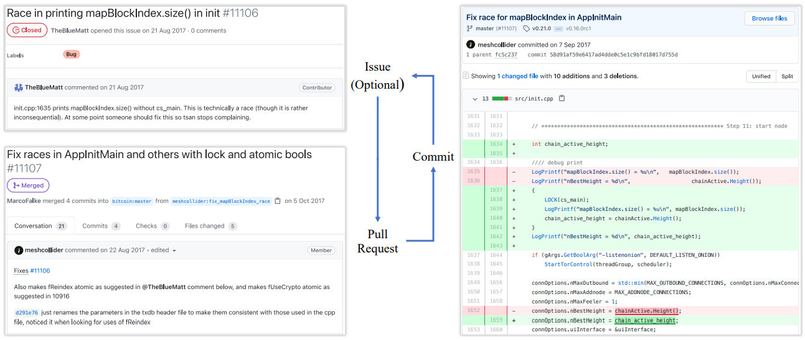

在这里，我们将介绍所研究的四个具有代表性的区块链的背景，以及这些区块链项目中典型的bug修复过程。

# 4个有代表性的区块链

在本文中，我们研究具有代表性的区块链：

1. 在加密货币市场非常流行；
2. 覆盖了区块链的不同种类；
3. 具有坚实的技术论文。

在这三个条件下，我们选择了经典的比特币[45]，智能合约平台以太坊[14]，匿名币Monero[46]，以及支付网络Stellar[39]。接下来，我们会在GitHub上介绍他们的基本信息，以及它们目前的发展状况。

比特币是第一个去中心化的加密货币，经常被称为“数字黄金”。比特币引入区块链[45]的概念，并将其用作分布式账本来记录交易，这样公众就可以验证。截至2021年10月18日，比特币加密货币(或BTC)排名第一，它的市值超过1.17万亿美元。比特币软件于2009年发布，现在GitHub上有超过820位贡献者；它的github库为：bitcoin / bitcoin。比特币的主要开发语言是c++。

以太坊是第一个能够构建图灵完备的区块链系统智能合约[14]，包含一组预定义的自执行规则和规则。为了维护以太坊的运营，它创建了一种名为Ether(或ETH)的原生加密货币。截至2021年10月18日，它是市值超过4480亿美元的第二大加密货币。以太坊软件于2015年在GitHub上发布，它的开发语言是Go，由660个贡献者在一个名为ethereum/go-ethereum的存储库中维护。

Monero的目标是减少区块链系统中的隐私泄露，因为每个区块链交易是透明的，可能会泄露一些敏感信息。为此，Monero使用了一个模糊帐本[46]，以防止交易细节(如，交易来源，金额，和目的地)，以免被外部观察者发现。截至2021年10月18日，门罗币(XMR)排名第39位，市值超过46亿美元。Monero软件于2014年发布在GitHub上，由超过250个贡献者在维护，它的库是monero-project / monero。Monero的主要开发语言是c++。

Stellar是一个基于区块链的支付网络[39]，可以在几秒钟内完成跨境转账。它使用一种新的共识协议，称为恒星共识协议(Stellar consensus protocol, SCP)[39]来实现快速以及不可信参与者之间的安全事务。Stellar的原生加密货币被称为XLM, 截至2021年10月18日，它的市值约90亿美元，排名第22位. Stellar软件于2015年在GitHub上发布，目前由超过70个贡献者在维护，它的库是stellar/stellar-core。类似于比特币和门罗币，Stellar的主要开发语言也是c++。

# 区块链中的Bugs修复过程

我们还需要了解这些存在GitHub上的开源区块链项目的典型错误修复过程，以便收集和分析他们的漏洞和补丁。这里会有三个概念:commit、issue和pull request。commit是一组已提交的更改，由开发人员导入项目资源库; 更改可以是任何内容，包括更改代码修改文档文件或合并多个以前的提交。一个issue通常是一个在GitHub页面的报告; 它可能描述一个潜在的bug，有时也可能是一个增强或问题，而且可能会导致修正和解决方案。pull request (PR)则是一个项目的提交建议或请求; 它从克隆项目中拉出来并被修改，然后提交到对原始项目，请求基于评审的开发人员检查是否需要接收克隆项目的修改。

这三者之间的关系，可以参见下图：

通常，当一个贡献者发现一个bug时，他/她会在项目的GitHub上创建一个问题报告此issue的页面。例如，上图显示了一个名为“TheBlueMatt”的贡献者发现了比特币中的一个竞赛，并在2017年8月21日的第11106期中报告了这个bug。之后, 一个名为“meshcollider”的开发者在PR #11107中添加了四个commit来修复这个问题。然后在2017年10月5日，MarcoFalke最终将PR中的提交合并到主存储库中。在在许多其他情况下，项目开发人员可以直接通过PR来修复代码，而无需创建问题(实际上，在我们的数据集中，88%的漏洞是通过PRs直接修补的)。作为一个结果, 为简单起见，我们在本文中没有明确区分问题和PR，因为后者经常出现也包含错误描述。事实上，GitHub本身混淆了issue/PR编号的使用。