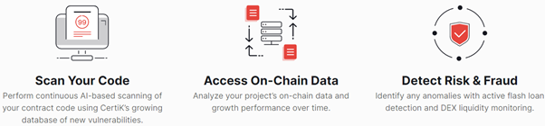

Certik作为区块链与智能合约的安全审计行业新秀，以其基于AI的形式化验证引擎，颇受资本和用户的关注。今天就来介绍一下它。

# Certik的4大产品

## 安全审计（Security Audit）

### 做什么

1. 安全审计

作为区块链和智能合约安全审计的领导者，该产品能够对智能合约与区块链展开各种评估，能够找出它们的漏洞，并能为弥补这些漏洞提供方案。

2. 高精准、可验证的、正式的审计

Certik拥有行业领先的审计方法学和工具。安全审计产品通过这些工具和方法论，可以检查你代码级的逻辑，并基于可数学推导的方法，来确保你的程序是按设计初衷运行的。

- 识别错误与风险：由长年累月的安全专家来检测程序代码；

- 纠正漏洞：提供评估报告，并在报告中会推荐你如何来弥补这些漏洞；

- 验证你的合约：基于高度可扩展的正式化的校验技术，来证明你的合约代码是正确的。

3. 已用该产品实战于多个案例

Certik已经针对各种主流区块链协议，主导了超过1800份的审计。并且是Binance、OKEx和Huobi所推荐的区块链和智能合约安全审计的供就商；下图显示了客户选用该产品的原因：

### 如何做

1. 审计的一般流程：

2. Certik安全审计流程

Certik的审计平台会评估合约中的漏洞，并论证合约中程序代码的行为，是与其功能定义初衷是否保持一致。

3. 审计报告将输出以下内容：

- 识别出来漏洞的详细描述；
- 对漏洞等级进行分级：Critical, Major, Medium, Low, and Informational；
- 针对这些漏洞的修改建议。

## 在线监测（Skynet）

### 做什么

使用行业领先的技术，对链上运行着的合约进行动态的监控与展示。

### 特点

1. 易读性：实时获取合约的安全得分

2. 6个维度的雷达图，充分展现链上合约安全的优劣势

3. 链上数据鲜活态势分析与展示

4. DEX流动性实时健康状况监测与报告

5. Token当前持有分布分析与展示

## 智能钱包跟踪与可视化工具（Skytrace）

### 做什么

它是一款智能钱包跟踪与可视化工具，让你可以跟踪资金的流向，并对其中的安全问题进行剖析。

它将展示并分析以太坊和BSC钱包的活动，辅助你跟踪可疑的活动，进而减少被欺诈的可能性。

### 特点

可以对钱包间的活动，进行了易理解的可视化展示。

## 渗透模拟攻击测试

### 做什么

动态地对你的Dapp，进行有深度的安全模拟攻击测试。

### 特点

1. 专有的工具，可以揭露最小的漏洞；

2. 由关键6步组成不断迭代的渗透测试过程

# Certik的愿景

除了Certik的区块链和智能合约安全审计的4大产品，其实更值得我们学习的是它的初衷：实现一个针对区块链和智能合约这个行业的去中心化的，形式化验证平台。

它的核心是一个是形式化验证框架，经过certik验证的智能合同、DApp以及区块链将会被附上证书形式的标志，来展示其正确性和安全性。Certik平台提供的主要功能包括以下部分：

1. 智能标签框架

应用深度学习技术来构建智能标签框架，有了这个框架，大多数共享逻辑和属性代码（前置条件，后置条件，不变量等）都可以被自动标记，从而使得程序的逻辑，语义更加清晰和规范，这样验证的工作量就可以大大减少。

2. 基于层的分解

这种技术揭示了分层设计模式的见解，并使得将复杂的证明任务分解为更小的任务成为可能，并在适当的抽象层面验证它们中的每一个。

3. 可插拔的验证引擎

提供开放式的协议，更先进算法的证明引擎可以自由插入这个系统。

4. 可自动检验的证明对象

构建自动证明对象（或者反例），这些证明对象可以快速的被任何人检验，同时作为验证程序的证书（自动证明对象可直接作为证书，但赏金猎人提供的证明对象，需要检察官进行人工检验后才能作为证书。注：赏金猎人和检察官后文会进行描述。）

5. 认证的DAPP库

为集成开发环境提供了一系列认证库和插件，以便开发出质量更高的dapp，但是会花费一些CTK。

6. 定制化的认证服务

如果有高可靠性要求，可以提供定制化的认证服务，由验证领域的专家提供帮助并出具综合报告。

Certik平台旨在围绕bug的检测和修复建立了一个去中心化的生态，该生态由五个角色构成，分别是客户、赏金猎人、检查官、社区贡献者以及开发使用者，该生态工运行模式如下图所示。

该系统可以分为自动化部分和人工部分。客户在certik平台上提交dapp或者程序系统，平台自动为其添加智能标签，并自动进行分解，形成小模块的证明任务，这个环节客户需要消耗一定量的CTK。

分解完小模块后，系统由两种方式进行验证，简单的证明任务可以由一些自动验证器(例如SMT解算器)解决。除了平台内部自带的验证器（证明引擎），CertiK平台提供开放协议，社区贡献者可以将带有更高级的求解算法的证明引擎自由地插入到该系统中，并获得一些CTK奖励。赏金猎人可以随机使用他们的引擎，并进行评估，优秀的引擎将被社区研究和推广。

另一种验证方式针对较为复杂的证明任务。赏金猎人接到该任务后，构建一个证明对象并进行广播，接着检查官对证明对象进行检测，当证明对象验证通过后，会被贴上证书的标签，赏金猎人和检查官分别获得CTK奖励。

所有分解的证明任务被验证后，CertiK平台的后端将返回详细而全面的评估报告。

开发使用者可以使用所有CertiK平台的认证库和IDE插件， 构建自己的DApp /系统；这需要花费一定的CTK。

Certik已获得投资者的青睐，相信如果能够完整地实现这个去中心化的形式化安全审计平台，其未来可期！